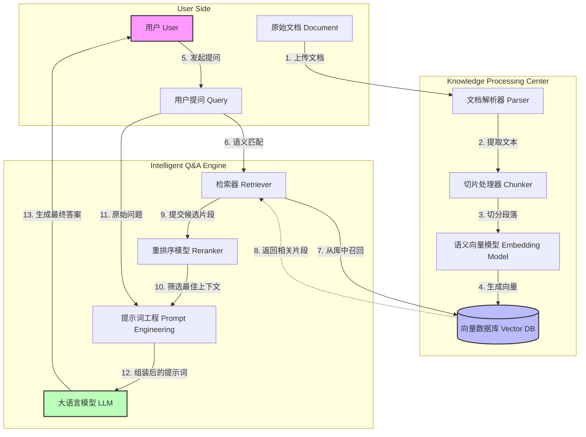
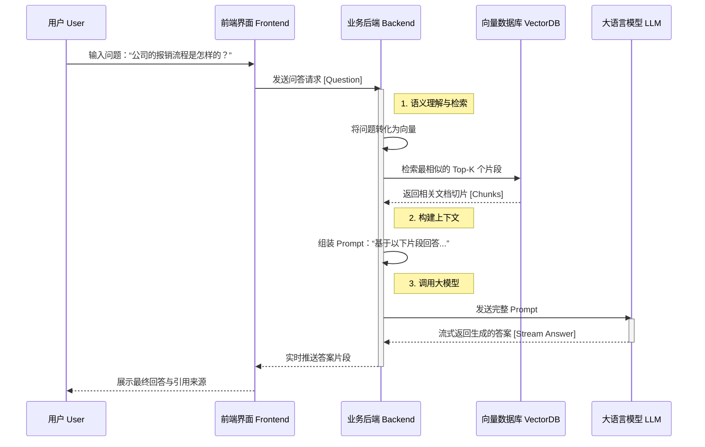

# RAG 系统核心业务架构解析 (Business Overview)

## 1. 业务背景与核心价值

**Retrieval-Augmented Generation (RAG)** 是一种结合了“检索”与“生成”的技术架构，旨在解决大语言模型（LLM）的幻觉问题和知识滞后问题。简单来说，就是给大模型装上了一个“外挂知识库”，让它基于真实的企业文档回答问题。

**核心价值：**
1.  **私有化知识问答**：基于企业内部文档（PDF, Word, Excel等）进行回答，数据不上公网。
2.  **降低幻觉风险**：回答有据可依，直接引用原文段落，减少胡编乱造。
3.  **即时更新**：无需重新训练模型，上传新文档即可立即生效。

---

## 2. 核心业务流程全景 (The Big Picture)

对于业务方而言，RAG 系统主要包含两个核心阶段：
1.  **知识入库 (Indexing)**：把各种格式的文档“喂”给系统，转化为系统能理解的知识。
2.  **智能问答 (Retrieval & Generation)**：用户提问，系统检索相关知识，生成精准回答。

### 核心业务流转图 (Process Flow)

---

## 3. 关键业务实体与角色 (Key Entities)

| 实体/角色 | 业务含义 | 关键属性 |
| :--- | :--- | :--- |
| **知识库 (Knowledge Base)** | 存放某一类文档的容器，类似于文件夹。 | 名称、描述、可见范围（公开/私有） |
| **文档 (Document)** | 上传的原始文件。 | 文件名、格式、上传时间、处理状态 |
| **切片 (Chunk)** | 文档被切分后的最小语义单元（一段话）。 | 原始内容、所属文档、语义向量 |
| **会话 (Session)** | 用户与系统的对话历史。 | 对话ID、用户ID、创建时间 |

---

## 4. 系统交互时序图 (Interaction Flow)

描述用户从提问到获得答案的端到端交互过程。

