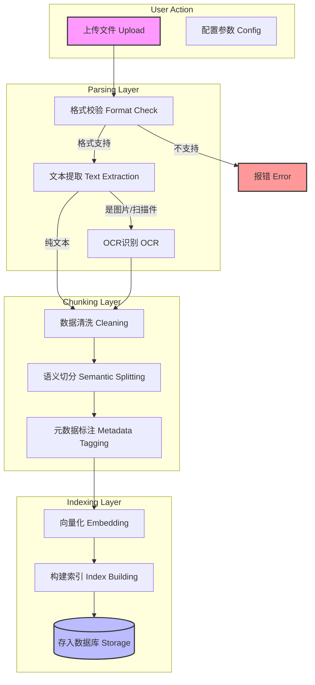
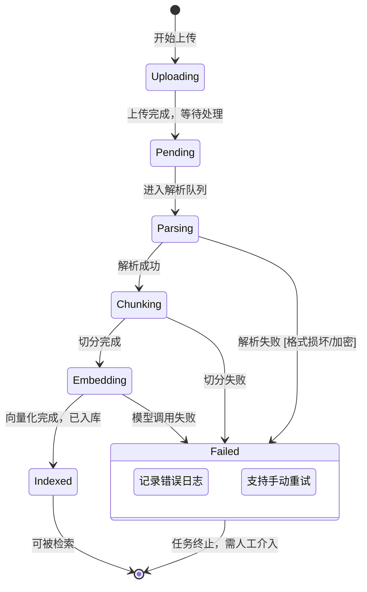

# 知识入库流程深度解析 (Knowledge Ingestion Pipeline)

## 1. 业务目标

知识入库是 RAG 系统的“粮仓”。本流程负责将非结构化的原始文件（PDF, Word, Excel, Images等）转化为计算机可理解、可检索的结构化数据。只有高质量的入库，才有高质量的回答。

**核心痛点：**
- **格式繁杂**：不同文件格式解析难度大（如扫描件PDF）。
- **语义丢失**：简单的按字数切分可能把一句完整的话切断。
- **数据更新**：文档修改后，如何快速同步更新索引？

---

## 2. 文档处理全流程 (End-to-End Flow)

从用户点击“上传”到文档变为“可搜索状态”，经历以下几个关键步骤：

---

## 3. 文档状态流转 (Document State Machine)

在系统后台，每个文档都有明确的生命周期状态。这对于监控任务进度和排查错误至关重要。

---

## 4. 异常处理机制 (Exception Handling)

| 异常场景 | 系统行为 | 业务建议 |
| :--- | :--- | :--- |
| **文件过大 (>50MB)** | 拒绝上传，提示限制。 | 建议拆分文件或联系管理员扩容。 |
| **格式不支持 (如 .exe)** | 校验拦截。 | 仅允许上传 PDF/Word/TXT/MD 等文本类文件。 |
| **解析超时 (OCR慢)** | 异步处理，状态长时间为 "Processing"。 | 增加超时时间设置，或优化 OCR 服务性能。 |
| **向量化失败 (API额度)** | 任务标记为 Failed，保留原始文件。 | 检查 API Key 余额，支持一键重试。 |

---

## 5. 关键技术细节 (Technical Deep Dive for PM)

虽然我们不需了解代码，但需知晓影响效果的几个关键参数：

1.  **切片大小 (Chunk Size)**：
    *   *定义*：每个知识片段包含多少字符（例如 500 字）。
    *   *影响*：太小导致语义不完整，太大导致检索不精准且浪费 Token。
    *   *默认建议*：500-1000 字符。
2.  **重叠窗口 (Overlap)**：
    *   *定义*：相邻两个切片之间重复的内容长度（例如 50 字）。
    *   *影响*：防止一句话被从中间切断，保持语义连贯性。
    *   *默认建议*：10-20%。
