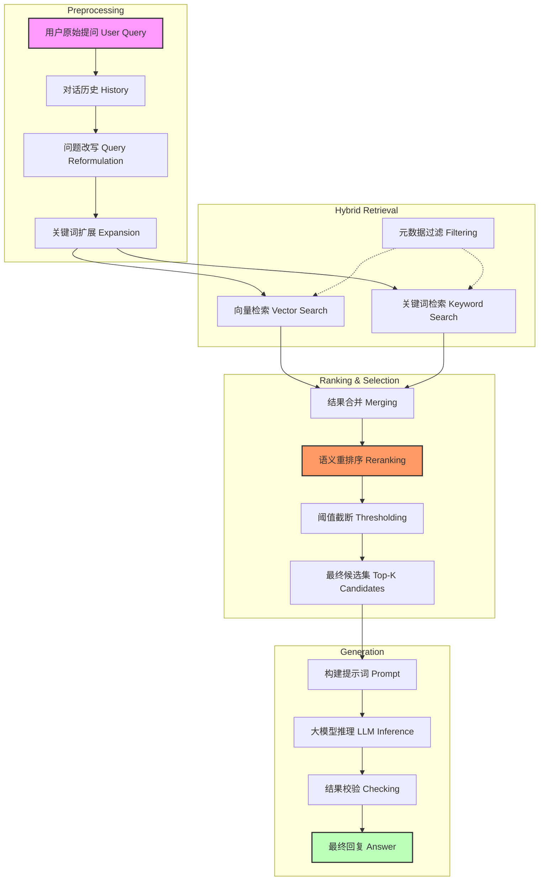
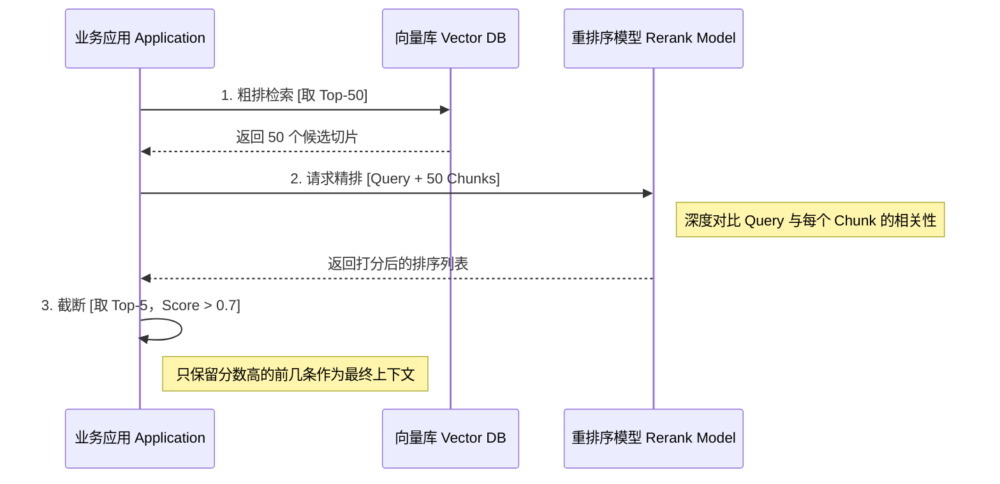

# 智能问答与检索逻辑详解 (Query & Retrieval Logic)

## 1. 业务核心：如何找到正确答案？

这部分是 RAG 系统的大脑。不仅仅是“搜索”，更包含了意图理解、精准排序和逻辑推理。

**核心挑战：**
- **语义匹配难**：用户搜“报销”，文档里写的是“差旅费申请”，关键字不匹配怎么办？（靠向量搜索解决）
- **无关干扰**：搜出来很多文档，但只有第一条有用，如何排除干扰？（靠重排序 Rerank 解决）
- **多轮对话**：用户接着问“那怎么申请呢？”，系统得知道他在问“报销流程”。（靠上下文管理解决）

---

## 2. 检索全流程 (Retrieval Workflow)

---

## 3. 关键逻辑点深度拆解

### 3.1 混合检索 (Hybrid Search)

为了兼顾“查得全”和“查得准”，通常采用 **向量检索 + 关键词检索** 双路召回策略。

*   **向量检索 (Dense Retrieval)**：
    *   *原理*：将文字转为向量，计算余弦相似度。
    *   *优势*：理解语义（搜“水果”能召回“苹果”）。
    *   *劣势*：专有名词匹配不精准（如型号 "X-2000"）。
*   **关键词检索 (BM25)**：
    *   *原理*：传统的搜索引擎技术，基于词频。
    *   *优势*：精准匹配专有名词、人名、地名。
    *   *劣势*：不懂语义，同义词无法召回。

### 3.2 重排序 (Rerank)

召回阶段（Retrieval）追求速度，可能找出 100 条候选。为了让 LLM 读得更少、更准，需要用更精细的模型对这 100 条进行二次打分。

---

## 4. 外部系统交互 (External Interactions)

| 系统组件 | 交互方式 | 作用 | 潜在风险 |
| :--- | :--- | :--- | :--- |
| **LLM API** (如 OpenAI) | HTTP POST | 生成回答、改写问题。 | 响应慢（Stream流式优化）、Token 超限（需预估长度）、幻觉（Prompt约束）。 |
| **Vector DB** (如 pgvector) | SQL / RPC | 存储向量、执行相似度搜索。 | 索引构建慢、内存占用高。 |
| **Embedding Model** | HTTP / RPC | 将文本转为向量。 | 并发量大时成为性能瓶颈。 |

---

## 5. 提示词工程 (Prompt Engineering)

这是 RAG 的最后一道防线。系统会自动组装一个包含“角色设定 + 召回知识 + 用户问题”的超长 Prompt。

**示例 Prompt 结构：**

> **[角色]** 你是一个专业的企业助手。
> **[约束]** 请严格基于以下提供的上下文回答问题，不要编造。如果上下文中没有答案，请直接说不知道。
> **[上下文]**
> 1. 根据《员工手册》第3章，报销需在每月25日前提交...
> 2. 财务部联系电话是 8888...
> **[问题]** 什么时候报销？

通过这种方式，强制大模型“看着书卷考试”，从而极大降低胡说八道的概率。
